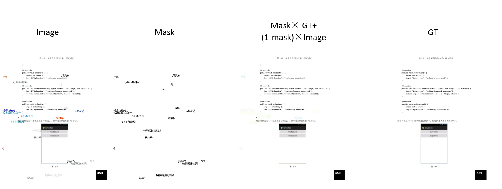
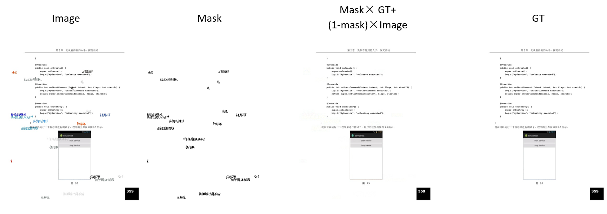
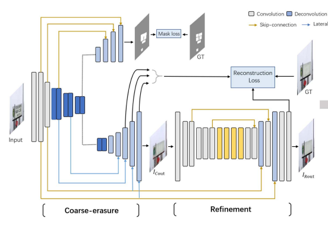

# 百度网盘AI大赛通用场景手写文字擦除第一名方案

比赛链接：[手写文字擦除](https://aistudio.baidu.com/aistudio/competition/detail/347/0/introduction)

## 一、赛题背景

​	随着技术发展，OCR扫描在学习、办公等众多场景中被使用，通过技术和算法，对扫描获得的纸张文档上的手写笔迹还原修复，恢复文件本身的样子，使得人们的使用体验越来越便捷。此次比赛需要参赛者对通用文件上的手写笔迹进行擦除后还原文件，帮助更多人解决扫描上的问题。如下图所示，左边的为输入图片，右边的为gt。

​	 

## 二、数据分析

官方提供了两类图片：文档类和试卷类。文档类的图片有。试卷类的图片有1081对，文档类的图片有120574张。

其中，文档类的图片相对比较规整，污渍、脏点比较少。而试卷类笔迹更杂乱，脏点较多，因此也更难处理。

首先，我们使用官方提供的baseline使用两类图片进行训练，然后将该模型分别对两类图片进行测试，发现两类共同训练的模型在文档类能够达到41的PSNR(在验证集上），而在试卷类的图片上只能够达到32左右的PSNR，baseline模型在两类图片上的预测分别如下面所示：


可以看到，baseline模型模型在两类图片上的差别较大，对于文档类图片可以达到较好的擦除效果，而对于试卷类的效果就没这么强，因此我们后面对两类图片进行分开训练推理。

对于文档类，数据集中提供了相应的mask，为了衡量mask的质量，我们将mask乘到GT图片上，然后替换image上对应区域，通过查看笔迹的残留区域来评估mask的质量。如下图所示：



​	可以看到，即使把image中的mask区域替换成gt，还是有不少笔迹残留，说明原有的mask质量不太好。因此我们尝试了采用常用的腐蚀膨胀，降低阈值来重新生成mask。其中腐蚀膨胀可以增加mask更多的边缘细节，但是降低阈值增加的细节似乎更加逼真，而且误遮挡的点更少。新生成的mask图和叠加之后的图如下所示：可以看到，新生成的mask大大减少了原有的笔记残留



此外，我们发现残留的位置大都为彩色笔迹，因此我们不采用计算三个通道的平均值来计算mask，而通过分别计算image和gt在三个通道的插值来生成mask.

## 三、模型设计

模型分为三个部分，分类模型，试卷模型，文档模型。分类模型采用的resnet18网络结构。文档类模型和baseline一致，我们采用的是EraseNet网络结构，在输入的时候，采用的是swin transformer来提取图片的全局特征。从下图可以看到，EeaseNet网络包含mask生成分支，Coarse图片生成分支和Refinement分支。在每个分支的decoder阶段都叠加了原来encoder的多尺度特征。在损失函数上，对mask采用l2损失，对粗粒度生成和修正后生成的图片采用重建损失对网络进行训练。试卷类模型沿用第一期比赛的方案，模型的主要区别在于没有采用swin transformer.




## 四、训练细节

​	我们注意到文档类中部分样本分辨率小于512，baseline中直接跳过了低分辨率样本而对高分辨率样本进行裁剪。而正式预测时会出现样本边缘为padding值的情况，因此，我们在裁剪之前对训练集样本加上了padding操作，同时加入了小角度旋转和水平翻转，以增强模型鲁棒性。

​	训练的batchsize为7；采用的优化器为Adam；初始学习率为： 1e-04 ；30000个step后将学习率降为原来的1/2；小角度旋转和水平翻转的概率为0.3 ；训练的显卡型号为RTX6000。

​	对于分类模型，由于文档类和试卷类的样本严重不均衡，实际训练过程中，我们每个epoch从训练集中选择所有的试卷类样本，然后重新随机采集的数量为0.9倍的文档类样本作为当前epoch的训练数据。

​	对于试卷类模型，我们采用上一届的方案进行训练推理，链接为：https://aistudio.baidu.com/aistudio/projectdetail/3439691?channelType=0&channel=0

​	对于文档类的模型，我们将训练数据集根据0.93:0.07的比例划分成训练集和验证集（大约600对，与A、B榜规模相当），训练时候验证集的精度和曲线如下所示：


## 五、测试细节

1. 测试时候的图片输入size为512x512, 分块推理再进行拼接。
2. 首先将图片输入至分类模型，得到对应的类别后使用对应类别图片的模型进行推理。
3. 由于原有maskGT可能不太准确，生成之后的mask也不能完全覆盖对应的手写区域，我们发现mask生成后还会有笔迹残留，因此直接采用refinement分支输出的图片作为结果，将mask给去掉。
4. 测试采用翻转镜像增强，将原图预测和镜像之后的预测结果进行平均作为最后输出。
5. 由于测试时采用的将图片裁剪分块测试，因此边缘部分信息较少，将预测的块边缘效果较差，因此加入了padding，(采用和训练时一致的padding mode效果稍好），并采用交错分块的方式对测试图像进行裁剪，两个裁剪块的交错尺寸设置为50。
6. 为了尽可能的优化时间，我们采用了多个策略，包括代码逻辑优化，删除推理模型中的mm部分，分块并行测试等方式。此外，我们还将paddle模型转换成了onnx模型，但最终推理时间并没有得到明显改善，可能是没有成功利用GPU而只采用CPU推理。

| 方法                                                | psnr  | 推理时间 |
| --------------------------------------------------- | ----- | -------- |
| Baseline                                            | 35.59 | 1.56     |
| +重叠裁剪推理                                       | 36.18 | 1.90     |
| +推理去掉mm                                         | 37.25 | 1.86     |
| +分块并行测试                                       | 37.25 | 1.116    |
| +两类图片分开测试                                   | 39.78 | 0.80     |
| +重新生成mask训练，增加padding,翻转，旋转等数据增强 | 40.47 | 0.79     |
| +图片镜像翻转测试                                   | 40.98 | 1.23     |
| +小学习率finetune                                   | 41.23 | 1.07     |
| -mm分支                                             | 41.23 | 1.05     |

## 六、代码内容说明

1. 数据集处理

   将数据集按以下文件路径放置：其中classone中是本届比赛提供的数据集（文档类），dehw_train_dataset是上一届比赛的数据集（试卷类）

     ```
     dataset
     ├── classone
     │  └── 01
     │     └── gt
     │     └── images
     │     └── mask
     │  └── 02
     │     └── gt
     │     └── images
     │     └── mask
     |  ...
     │  └── 20
     │     └── gt
     │     └── images
     │     └── mask
     
     ├── dehw_train_dataset
     │     └── gt
     │     └── images
     │     └── mask
     ```

   重新生成mask

   将data_root和data_path改成对应的数据路径

   ```
   python generate_mask5.py
   ```

2. 启动训练

   指定数据集路径：dataRoot

   指定预训练模型路径：pretrained

   ```
   python trainNewMaskAugSchedule.py
   ```

3. 进行推理

   ```
   cd Final
   python predict.py src_image/ save_image
   ```

   最终将Final打包提交即可得到我们的线上成绩

## 七、预训练模型

我们将模型上传至：

STE_str_best.pdparams: https://aistudio.baidu.com/bj-cpu-01/user/446178/4503672/doc/tree/work/Final/model/STE_str_best.pdparams


## 八、其他尝试

